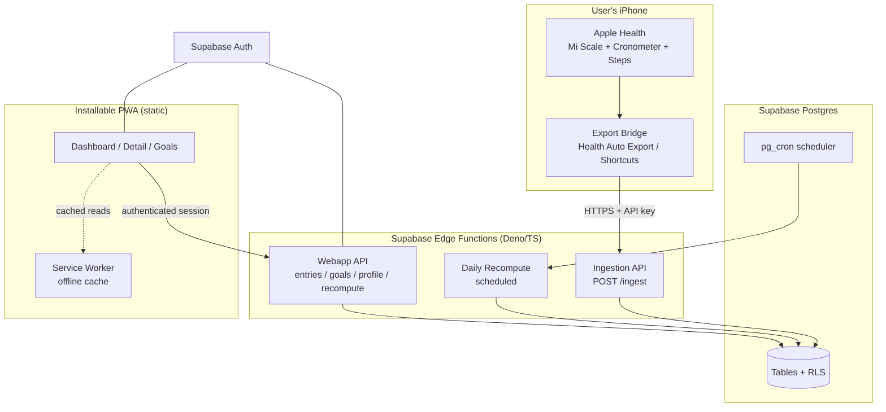
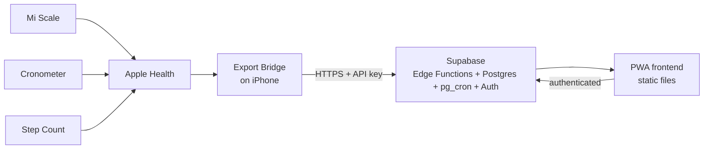

# Design Document

## Overview

TDEETracker Webapp replaces the native iOS app with a browser-based, installable (PWA) system. It reuses the stack the account owner already operates successfully in the family World Cup tracker — **Supabase (Postgres + Auth) fronted by a static single-page PWA** — and adds the two capabilities that project never needed:

1. An **authenticated, server-side Ingestion API** that receives health data POSTed twice daily by an Apple-device export bridge (Health Auto Export or a Shortcuts automation). This cannot rely on browser-side Row Level Security the way the World Cup app does, because the caller is an automation holding a secret, not a logged-in browser.
2. A **scheduled Daily Recompute job** that recalculates TDEE and the daily calorie target after the day's data is complete, so the dashboard is correct every morning. The World Cup app had no scheduled/background work.

The design keeps the calculation logic (TDEE rolling window, imputation, trend weight, BMR estimate, calorie target, BMI guardrails) on the server so it is computed once per day and simply read by the client, rather than recomputed in every browser session.

This document covers the receiving/computing/presenting sides. The Export_Bridge itself is external and out of scope beyond the JSON contract it must satisfy.

## Architecture

### High-level component diagram



### Technology choices and rationale

| Concern | Choice | Rationale |
|---|---|---|
| Data store | Supabase Postgres | Same platform as the World Cup app; managed backups, TLS, and Row Level Security out of the box (Req 22). Relational model fits time-series health entries and goals cleanly. |
| Auth (webapp) | Supabase Auth (email+password, single user) | Managed, hashed credentials (Req 20.4), session cookies with Secure/HttpOnly, configurable session lifetime (Req 22.4-5). No self-service signup — the one account is provisioned at deploy time. |
| Ingestion + compute | Supabase Edge Functions (Deno/TypeScript) | Server-side secret handling for the API key (Req 1), request validation (Req 4), and a home for the TDEE engine in TypeScript. Co-located with the database. |
| Scheduling | Supabase `pg_cron` invoking the recompute Edge Function | Native to Supabase; drives the twice-daily-aware Daily Recompute (Req 5). Avoids introducing a third platform. |
| Frontend | Static PWA (vanilla or a light framework), charts via a JS charting lib | Mirrors the World Cup single-page approach; installable, offline-capable (Req 21). |
| Hosting (frontend) | Supabase static hosting or Netlify/Vercel static | Static assets only; all logic is in Edge Functions + Postgres. |

### Why not the pure World Cup pattern (browser → Supabase with anon key + RLS)

The World Cup app ships the anon key in the page and relies entirely on RLS, with a client-side passcode "gate." That is acceptable for low-stakes family predictions. For personal health data we additionally need: (a) a secret-authenticated ingestion path for the automation (no browser, no RLS session), and (b) server-side scheduled computation. Reads from the authenticated browser can still use Supabase's RLS-backed client directly; writes and computation go through Edge Functions so secrets and heavy logic never live in the page.

### Trust boundaries

- **Export_Bridge → Ingestion API**: authenticated by a hashed API key (Req 1), TLS only (Req 22.1), rate-limited (Req 22.3).
- **Browser → Webapp API / Supabase**: authenticated Supabase session; RLS ensures only the account owner's rows are readable (Req 20.1). Single-user, so RLS is effectively "row belongs to the one account."
- **pg_cron → Recompute**: internal, invoked with a service role secret held only in the Edge Function environment.

## Deployment Topology

This section clarifies exactly how many platforms are involved, and which ones this project builds and operates versus which already exist. The intent is to show that although data passes through several links, we stand up and host essentially **one** platform (Supabase), with an optional second only if the frontend is hosted elsewhere.

### The links, end to end



### Who owns what

| # | Link | Type | Built/hosted by us? | Notes / cost |
|---|---|---|---|---|
| 1 | Mi Scale | Existing device | No | Already syncs weight + body fat to Apple Health. |
| 2 | Cronometer | Existing app | No | Already syncs nutrition to Apple Health. |
| 3 | Apple Health | Existing on-device hub | No | Aggregates all metrics on the phone; not a platform we manage. |
| 4 | Export Bridge (Shortcuts or Health Auto Export) | On-device automation | Configured, not hosted | Runs on the iPhone; POSTs JSON twice daily to one URL. Free (Shortcuts) or a one-time app purchase (Health Auto Export). Not a server we operate. |
| 5 | **Supabase** | **Managed cloud platform — the core** | **Yes** | A single account provides all four backend concerns: Postgres (data store), Edge Functions (ingestion endpoint + TDEE/calorie computation), pg_cron (scheduled Daily Recompute), and Auth (login). Free tier is sufficient for one user. |
| 6 | Frontend host | Static file hosting | Yes (separate free host) | Serves the PWA. Supabase has NO static-hosting product, so this is a separate free static host — Netlify / Cloudflare Pages / Vercel / GitHub Pages. This is the standard Supabase pattern (their own docs pair with Vercel). |

### Platform count summary

- **Links 1-3** already exist and are unchanged; we build nothing there.
- **Link 4** is an automation on the phone, not a hosted platform.
- **Link 5 (Supabase) is the one backend platform we build and operate.** It collapses four services (database, application server, cron/scheduler, auth provider) into a single managed account.
- **Link 6** is a separate free static host for the frontend. Supabase does **not** host static sites (Storage buckets can serve files but break PWA root paths / service-worker scope, so they are not a real host).

Net: **two free platforms — Supabase (backend) + one static host (frontend).** This is the minimum for this stack, not reducible to one. Everything upstream of the HTTPS POST already runs on the phone.

### Safety-driven decisions (chosen over the more minimal variant)

The account owner has opted for the **safest** configuration rather than the absolute-minimum one. Accordingly, this design fixes the following (resolving the open design choices):

- **All health-data reads go through the authenticated Webapp API / RLS-protected access, not anonymous browser-direct queries.** Even though single-user RLS would technically allow browser-direct reads (as in the World Cup app), routing reads through authenticated access keeps a single, auditable access path and avoids shipping broad query capability in the page.
- **TDEE/calorie computation stays in TypeScript Edge Functions** (not pushed into raw SQL/pg_cron logic). This is easier to port from the Swift originals, easier to unit-test against the native app's known values, and keeps the math in one reviewable place.
- **All secrets remain server-side** (Edge Function environment / Supabase secrets); the browser only ever holds the RLS-scoped anon key and the user's session (Req 22.2).

## Feasibility and Cost (Free-First Decision)

The account owner has chosen to implement using **absolutely free options first**, and to consider paid alternatives only if a free option proves unreliable in practice. This section records that decision and the known constraints, verified against current platform documentation.

### Free-first component choices

| Concern | Free choice (implement first) | Paid fallback (only if free fails) |
|---|---|---|
| Export bridge | **Apple Shortcuts** time-of-day automation using the "Get Contents of URL" action to POST Health data | Health Auto Export app's REST API automation (small one-time/subscription cost; more reliable unattended background sync) |
| Backend (DB + compute + scheduler + auth) | **Supabase Free tier** — Postgres, Edge Functions, pg_cron (enabled by default), Auth | Supabase Pro ($25/mo) — only if pausing or limits become a problem |
| Frontend hosting | **GitHub Pages** (or Supabase static hosting) | n/a — static hosting is free everywhere |

### What is genuinely free

- **Supabase Free tier** comfortably covers a single user: 500 MB database (our data is a few MB over years), 5 GB monthly egress (negligible for one user), unlimited API requests, Edge Functions bundled, and `pg_cron` enabled by default for the scheduled recompute.
- **Apple Shortcuts** is free and can POST to a REST endpoint on a time-of-day schedule.
- **GitHub Pages / Supabase static hosting** for the PWA is free.

Net cost of the free-first build: **$0.**

### Known constraints and how the free-first build handles them

1. **Supabase free projects pause after ~7 days of inactivity.** The twice-daily ingestion POST is external traffic that keeps the project active, so normal use avoids pausing. If the bridge stops for a week, the project may pause and require a manual unpause from the dashboard. Accepted for the free build; Pro removes pausing if it ever becomes a real nuisance.
2. **Shortcuts unattended reliability.** Time-of-day automations can run without prompting when "Ask Before Running" is disabled, but fully silent background execution touching Health data can be inconsistent. This is the most likely free option to "fail" in practice; if it proves unreliable, the paid Health Auto Export bridge is the designated fallback. The system is designed so switching bridges changes only the client that calls the Ingestion API — the payload contract and everything server-side stay identical.
3. **pg_cron runs in UTC.** The recompute schedule uses a fixed UTC offset to fire before local midnight; it must be adjusted manually for time-zone/DST changes.

### Migration path if a free option fails

Because the Ingestion API defines a stable JSON contract, the export bridge is fully swappable: moving from Shortcuts to Health Auto Export (or any other exporter) requires no server or schema change. Likewise, upgrading Supabase Free → Pro is a plan change with no code change. This keeps the free-first path low-risk.

## Components and Interfaces

### Component 1: Ingestion API (`POST /ingest`)

Responsibility: receive a Health_Payload, authenticate, validate, upsert entries, update the sync timestamp. Implements Req 1-4.

- **Auth**: reads an `X-API-Key` header, compares a salted hash against the configured hash (constant-time compare). Rejects with 401 and logs timestamp + source IP on failure (Req 1.2, 1.4).
- **Validation** (Req 4): per-entry — require `date`; reject negative/non-numeric values; reject dates more than 1 day in the future. Invalid entries are collected and reported; valid entries in the same payload still persist (Req 4.4, 2.5).
- **Upsert** (Req 2, 3): `INSERT ... ON CONFLICT (date) DO UPDATE` per metric table, giving idempotency by construction.
- **Response**: 200 with the list of affected Entry_Dates and a per-entry rejection report; updates `sync_state.last_sync_at` (Req 2.6).
- **Does not compute TDEE inline** — computation is deferred to Daily Recompute (or an explicit on-demand call) to keep ingestion fast and idempotent.

Payload contract (accepted shape):

```json
{
  "entries": [
    {
      "date": "2026-07-04",
      "weightKg": 74.2,
      "bodyFat": 0.182,
      "steps": 8450,
      "nutrition": { "calories": 2100, "protein": 150, "carbs": 190, "fat": 70, "fiber": 30 }
    }
  ]
}
```
All metric fields are optional except `date`; a payload may carry any subset (e.g. weight-only from the scale, nutrition-only from Cronometer).

### Component 2: Webapp API (authenticated)

Responsibility: CRUD for entries, goals, and profile on behalf of the logged-in owner, plus an on-demand recompute trigger. Implements Req 6, 7, 8, 9, 15.3, and read endpoints for the frontend.

Endpoints (Edge Functions or PostgREST + RLS):
- `GET /entries?metric=&range=` — historical entries for a metric within a Time_Range (Req 18).
- `POST /entries`, `PATCH /entries/:id`, `DELETE /entries/:id` — manual add/edit/delete with validation (Req 6).
- `GET/PUT /profile` — profile with derived age (Req 7).
- `GET/POST/PATCH/DELETE /goals` — main goal and subgoals (Req 8, 9).
- `GET /tdee/history` — TDEE_Records ordered by end date (Req 15.3).
- `GET /dashboard` — aggregated payload: latest values, 7-day moving averages, current TDEE (+source flag), calorie target (+flags), sync timestamp (Req 17).
- `POST /recompute` — on-demand recompute (the web equivalent of the native pull-to-refresh), reusing the Daily Recompute logic.

Per the safety-driven decision in Deployment Topology, all reads go through authenticated access (Edge Functions and/or PostgREST behind RLS with a valid session) rather than anonymous browser-direct queries, keeping a single auditable access path.

### Component 3: TDEE Engine (server-side library)

A TypeScript port of the native `TDEECalculatorV2`, `WeightTrendCalculator`, `fillMissingWeightData`, and the Mifflin-St Jeor estimate. Shared by Daily Recompute and `POST /recompute`. Pure functions over arrays of `{date, value}` — no DB access inside the math, so it is unit-testable in isolation. Detailed algorithms in the next section. Implements Req 11-16.

### Component 4: Daily Recompute (scheduled)

Responsibility: after the final Sync_Window, recompute TDEE_Records and the calorie target for the current day. Implements Req 5, 15, 16.

- Triggered by `pg_cron` shortly after the final Sync_Window (e.g. 00:15 local-equivalent UTC) and optionally after the earlier window.
- Steps: load weight + calorie history → run the rolling-window search and per-window TDEE → upsert TDEE_Records (Req 15.2) → compute current TDEE (data-driven, else estimated) → compute calorie target with guardrails → store the current-target snapshot.
- **Idempotent** (Req 5.5): upserts keyed by window end date and a single current-target row; re-running yields identical state.

### Component 5: Frontend PWA

Responsibility: render dashboard, metric details, goals, profile; installable and offline-tolerant. Implements Req 17-21.

- Tabs mirroring the native app: **Dashboard**, **Goals**, **Settings/Profile**, with metric detail views reached from summary cards.
- Charts: raw + moving average + goal line + deviation lines (Req 18); stacked macro composition + TDEE overlay (Req 19).
- **Service worker** caches the last dashboard payload for offline display with a staleness banner (Req 21.3); **web app manifest** + icons for home-screen install and standalone mode (Req 21.1-2).

## Data Models

Postgres schema (single-user; no `user_id` partitioning per the single-user constraint). All date columns store the Entry_Date normalized to local start-of-day.

```mermaid
erDiagram
    weight_entries { date entry_date PK; double value_kg }
    body_fat_entries { date entry_date PK; double value_fraction }
    step_entries { date entry_date PK; double steps }
    calorie_entries { date entry_date PK; double calories; double protein_g; double carbs_g; double fat_g; double fiber_g }
    tdee_records { date window_end PK; date window_start; double value; int valid_days }
    user_goals { uuid id PK; text goal_type; double target_value; date goal_date; smallint order_index; double current_value_at_set; bool is_completed; timestamptz completion_date; timestamptz date_set }
    user_profile { int id PK; text name; date date_of_birth; double height_cm; text gender; double activity_pal; double calorie_goal }
    current_target { int id PK; double calorie_target; double tdee_used; text tdee_source; bool rate_capped; bool date_unachievable; timestamptz computed_at }
    sync_state { int id PK; timestamptz last_sync_at }
```

Notes:
- One row per metric per day enforced by a unique/PK constraint on `entry_date`, giving ingestion idempotency (Req 3) via `ON CONFLICT`.
- `body_fat_entries.value_fraction` stores the decimal fraction (0.15 = 15%), matching the native model; the frontend multiplies by 100 for display.
- `tdee_records` keyed by `window_end` so recompute upserts overwrite same-window results (Req 15.2).
- `user_goals.order_index = -1` denotes the Main_Goal; positive integers are ordered Subgoals (Req 8, 9), matching the native convention.
- `user_profile` is a singleton (fixed `id = 1`); `activity_pal` stores the PAL multiplier; `calorie_goal` is the optional stored onboarding/bootstrap goal.
- `current_target` is a singleton snapshot the dashboard reads directly, carrying the guardrail flags from Req 16.2/16.6.
- RLS: enabled on all tables; policies restrict access to the authenticated owner. Ingestion writes use the service role inside the Edge Function (bypassing RLS server-side, never exposing the service key to the browser).

## Algorithms

### TDEE rolling-window (Req 11, 12) — port of `TDEECalculatorV2`

```
findValidWindows(caloriesByDay, windowSize=12, minValidDays=7):
  windowEnd = today
  loop:
    windowStart = windowEnd - (windowSize-1) days
    days = [windowStart .. windowEnd]
    validDays = days where caloriesByDay[day] exists (calories > 0)
    if validDays is empty: break            # no data further back
    if validDays.count >= minValidDays: record window
    windowEnd -= 1 day

calculateTDEE(window):
  validDays = days in window with calories
  if validDays.count < 7: return null
  avg = mean(calories over validDays)
  totalCalories = sum over all 12 days of (actual calories or avg if missing)   # imputation (Req 12)
  wStart = trendWeight(window.start); wEnd = trendWeight(window.end)             # Req 13
  if wStart or wEnd undetermined: return null
  return (totalCalories - (wEnd - wStart) * 7700) / 12
```

The "most recent valid window" (first found scanning backward from today) provides the current data-driven TDEE; iterating all windows produces the historical trend for `tdee_records`.

### Trend weight (Req 13) — port of `WeightTrendCalculator` + `fillMissingWeightData`

```
fillMissingWeightData(rawWeights, from, to):
  for each day in [from..to]:
    if recorded: use it
    else if earlier and later recorded exist: linear interpolation
    else if only one side exists: use nearest single value
    else: carry the overall first/last known value at the ends

trendWeight(date, window=7):
  vals = filled weights for [date-6 .. date]
  if vals.count < 7: return undetermined
  return mean(vals)
```

### Estimated TDEE bootstrap (Req 14)

```
BMR (Mifflin-St Jeor):
  male:   10*kg + 6.25*cm - 5*age + 5
  female: 10*kg + 6.25*cm - 5*age - 161
estimatedTDEE = BMR * activity_pal
```
Used only when no data-driven window is available; the frontend labels it "estimated" (Req 14.3).

### BMI guardrails + calorie target (Req 10, 16)

```
bmi = weightKg / (heightM^2)
maxWeeklyLossKg =
  bmi < 18.5 : 0        # loss disallowed; gain only
  18.5–25    : 0.25
  25–30      : 0.35
  30–40      : 0.5
  >= 40      : 1.0

targetDateWeeks = clamp( |targetWeight - currentTrendWeight| / rate, 2, 52 )

calorieTarget:
  if no weight main goal: target = currentTDEE            # maintenance (Req 16.4)
  else:
    requiredWeeklyChange = (targetWeight - currentTrendWeight) / weeksToGoalDate
    if |requiredWeeklyChange| exceeds permitted rate:
        cap to permitted rate; set date_unachievable flag  # Req 16.2
    dailyAdjustment = (cappedWeeklyChange * 7700) / 7
    target = currentTDEE + dailyAdjustment
  target = max(1200, target)                               # floor (Req 16.3)
  if underweight and goal is loss: warn/reject             # Req 10.4
```

## Security Design (Req 22)

- **TLS everywhere** — Supabase and the static host serve HTTPS; the Edge Function rejects non-TLS (platform-enforced).
- **Secrets** — API key hash, service role key, and Supabase keys live in Edge Function environment / Supabase secrets, never in the repo or the shipped page (Req 22.2). The browser only ever holds the anon key (RLS-protected) and the user's session.
- **Rate limiting** — the Ingestion function and the login path throttle repeated failures per source (Req 22.3), backed by a small counter table or platform rate limiting.
- **Sessions** — Supabase Auth issues Secure/HttpOnly cookies with a configurable max lifetime; expiry forces re-auth (Req 22.4-5).
- **Error hygiene** — validation/auth errors return minimal messages; no stack traces, DB internals, or the expected key (Req 22.6).
- **Least privilege** — RLS restricts browser access to the owner's rows; the service role is confined to Edge Functions (Req 22.7).

## Offline & PWA (Req 21)

- **Manifest** with name, icons (reuse the native app's icon set), `display: standalone`, theme colors.
- **Service worker**: cache-first for the app shell; the last successful `/dashboard` response is cached and shown offline with a "data may be stale" banner. No offline writes in v1 — mutations require connectivity.

## Error Handling

| Situation | Handling | Requirement |
|---|---|---|
| Bad/missing API key | 401, logged; no writes | 1.2, 1.4 |
| Partially invalid payload | Store valid entries; 400-style report for invalid ones | 4.4 |
| Not enough data for TDEE | Fall back to Estimated_TDEE; else undetermined empty state | 14 |
| No weight main goal | Calorie target = maintenance (TDEE) | 16.4 |
| Goal date too aggressive | Cap at healthy rate; flag unachievable | 16.2 |
| Underweight + loss goal | Warn/reject | 10.4 |
| Offline | Serve cached dashboard + staleness banner | 21.3 |
| Missing profile field for a calc | Clear "which field" error | 7.4 |

## Testing Strategy

- **Unit (highest value)**: the TDEE engine — rolling-window selection, calorie imputation, weight interpolation/trend, BMR estimate, BMI guardrails, calorie-target capping and 1200 floor. Pure functions over fixtures; port the native app's known scenarios so the webapp reproduces the same TDEE values (continuity, Req 11 intent). Include property tests for idempotency (Req 3.2, 5.5).
- **Integration**: ingestion upsert/idempotency against a test Postgres; validation partial-accept; recompute end-to-end producing `tdee_records` + `current_target`.
- **Auth/security**: 401 on missing/bad key; RLS blocks unauthenticated reads; rate-limit throttling; no secret leakage in errors.
- **Frontend**: dashboard empty states, chart rendering with sparse data, PWA install + offline staleness banner.

## Correctness Properties

These are invariants the implementation must uphold; they double as the basis for property-based tests.

Property 1: Ingestion idempotency — For any sequence of Health_Payload submissions, the Data_Store contains exactly one record per metric per Entry_Date, and the final stored values equal those of the last-processed submission for that date.
**Validates: Requirements 3.1, 3.2**

Property 2: Recompute idempotency — Running Daily Recompute N times for the same input data produces identical `tdee_records` and `current_target` as running it once.
**Validates: Requirements 5.5**

Property 3: Partial-accept integrity — After ingesting a payload containing both valid and invalid entries, every valid entry is stored and no invalid entry is stored.
**Validates: Requirements 4.4**

Property 4: Calorie-target safety floor — The stored `calorie_target` is never below 1200 kcal, and its implied weekly weight-change never exceeds the BMI-tier permitted rate.
**Validates: Requirements 16.2, 16.3**

Property 5: TDEE source preference — When a data-driven TDEE_Record exists for the current window, `current_target.tdee_source` is "data-driven"; the estimated value is used only when no data-driven value exists.
**Validates: Requirements 14.2**

Property 6: Window validity — Every stored TDEE_Record corresponds to a 12-day window with at least 7 Valid_Calorie_Days and determinable start and end Trend_Weight.
**Validates: Requirements 11.1, 11.2, 11.3, 11.6**

Property 7: Auth non-leakage — No rejected request (auth or validation) response body contains the expected credential, stack traces, or database internals.
**Validates: Requirements 22.6**

Property 8: Access isolation — No unauthenticated request returns or mutates health data.
**Validates: Requirements 20.1**

## Requirements Traceability

| Requirement | Where addressed |
|---|---|
| 1 Ingestion auth | Ingestion API (API key hash, logging) |
| 2 Payload ingestion | Ingestion API upserts; payload contract |
| 3 Idempotency | PK-per-day + `ON CONFLICT` |
| 4 Validation | Ingestion API per-entry validation, partial accept |
| 5 Sync cadence / recompute | Daily Recompute + pg_cron; idempotent |
| 6 Manual entry | Webapp API entries CRUD |
| 7 Profile | Webapp API profile; derived age; default PAL |
| 8 Main goal | user_goals order_index = -1 |
| 9 Subgoals | user_goals positive order_index |
| 10 Guardrails | BMI-tier rate + ideal weight + target date |
| 11 Rolling window | TDEE Engine findValidWindows/calculateTDEE |
| 12 Imputation | TDEE Engine window averaging |
| 13 Trend weight | fillMissingWeightData + SMA |
| 14 Estimated TDEE | BMR × PAL fallback |
| 15 TDEE history | tdee_records upsert + /tdee/history |
| 16 Calorie target | guardrail-capped target + floor + snapshot |
| 17 Dashboard | /dashboard aggregate + cards |
| 18 Detail charts | metric detail views + Webapp API reads |
| 19 Macro composition | stacked macro chart + derived alcohol + TDEE overlay |
| 20 Webapp auth | Supabase Auth |
| 21 PWA | manifest + service worker |
| 22 Security | TLS, secrets, rate limit, sessions, RLS |
