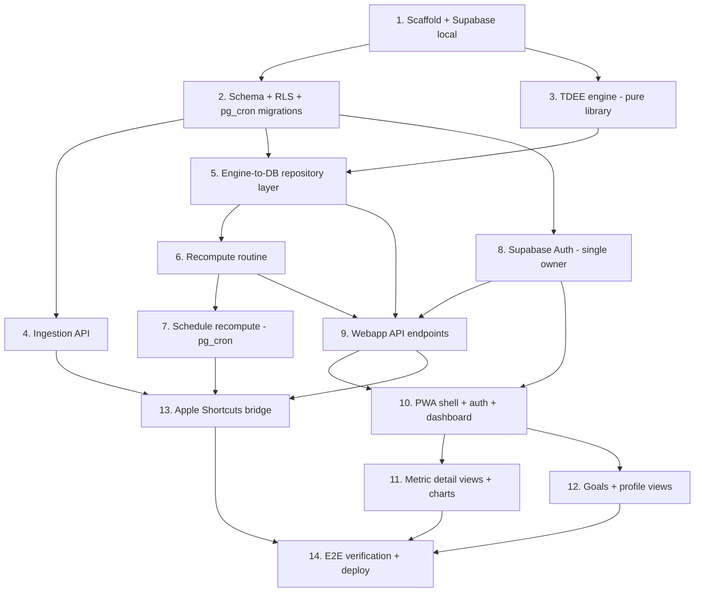

# Implementation Plan

## Overview

This plan builds the free-first stack: Supabase (Free tier) for Postgres + Edge Functions + pg_cron + Auth, an Apple Shortcuts export bridge, and a static PWA on GitHub Pages (any free static host works; Supabase itself does not serve static sites). Tasks are ordered so the pure calculation logic (highest value, fully unit-testable) is built and verified before it is wired to the database and UI. Each task builds on prior tasks and ends in working, tested code.

## Tasks

- [x] 1. Scaffold the project and Supabase local environment
  - Initialized the TypeScript workspace: `packages/engine/` (pure calculation library), `supabase/` (config + `migrations/` + `functions/`), and `web/` for the PWA.
  - Set up the test runner (Vitest, since Deno is not installed) and lint/format (ESLint 9 flat config + Prettier); engine build + tests pass; 0 production-dependency vulnerabilities.
  - Supabase CLI / Docker / Deno are not installed on this machine, so the local Supabase runtime (`supabase start`) is deferred; folder structure and `config.toml` are in place, and tasks 2/4/5/6/7 can target a hosted Supabase Free project via `supabase db push` when the CLI is available. Documented in README.
  - _Requirements: platform foundation for all requirements_

- [x] 2. Define the database schema and Row Level Security as migrations
  - **Status: Applied and verified on the hosted Free project (all three migrations ran clean — "no rows returned", expected for DDL). Auto-expose-new-tables OFF, so explicit GRANTs to the authenticated role were added.**
  - [x] 2.1 Write the migration for all data tables
    - Authored `20260705090000_schema.sql`: `weight_entries`, `body_fat_entries`, `step_entries`, `calorie_entries` (keyed by `entry_date`), `tdee_records` (keyed by `window_end`), `user_goals` (with a partial unique index enforcing one Main_Goal per type), singleton `user_profile` / `current_target` / `sync_state` (seeded), value CHECK constraints, and `updated_at` triggers.
    - _Requirements: 2.1-2.4, 3.1, 15.1, 7.1, 8.1, 9.1, 16, 17.4_
  - [x] 2.2 Enable RLS and add owner-only policies
    - Applied `20260705090100_rls.sql`: RLS enabled on every table; `for all to authenticated` owner policies; explicit GRANTs to authenticated (auto-expose off); anon denied; service role bypasses server-side.
    - _Requirements: 20.1, 22.7_
  - [x] 2.3 Enable pg_cron and pg_net extensions via migration
    - Applied `20260705090200_extensions_cron.sql`: enabled `pg_cron` + `pg_net`; includes the commented Daily Recompute `cron.schedule` template (finalized in task 7 once the function URL + secret exist).
    - _Requirements: 5.4_

- [x] 3. Build the TDEE calculation engine as a pure, unit-tested library
  - [x] 3.1 Port trend-weight and weight imputation
    - Implemented `fillMissingWeightData` (linear interpolation, single-sided nearest, end-carry) and `trendWeight` (7-day SMA, undetermined when <7 days) as pure functions over `DatedValue[]`, plus `computeTrendWeight`. Added `date.ts` (clockless ISO-day arithmetic) and `util.ts`.
    - Unit tests cover sparse data, two-sided interpolation, single-sided carry, and the undetermined case.
    - _Requirements: 13.1-13.4_
  - [x] 3.2 Port rolling-window search and per-window TDEE with imputation
    - Implemented `findValidWindows` (12-day window, ≥7 valid calorie days, scan backward from `today`), `calculateWindowTdee` (window-average calorie imputation; `(totalCalories − Δtrendweight×7700)/12` using trend-weight deltas per Req 11.5), and `computeWindowTdees` (current + ascending history).
    - Unit tests cover exactly-7-day windows, fully populated windows, imputation, and exclusion on undetermined trend weight.
    - _Requirements: 11.1-11.6, 12.1-12.2_
  - [x] 3.3 Port the Mifflin-St Jeor BMR and estimated-TDEE fallback
    - Implemented `bmr` (male/female/other variants, safe default) and `estimatedTdee = bmr × activityPAL`.
    - Unit tests cover both equations, the "other" path, and safe-default on invalid input.
    - _Requirements: 14.1_
  - [x] 3.4 Implement BMI guardrails, ideal weight, and target-date logic
    - Implemented `bmi`, `idealWeightKg` (BMI 21.7, +5% male, round 0.5 kg), `permittedWeeklyChangeKg` (BMI-tiered loss/gain), `suggestTargetDateWeeks`/`suggestTargetDate` (change ÷ rate, clamp 2-52 weeks), and `isLossDisallowed`.
    - Unit tests cover each BMI tier boundary, ideal-weight rounding, clamps, and the underweight case.
    - _Requirements: 10.1-10.4_
  - [x] 3.5 Implement the goal-based calorie target with capping and floor
    - Implemented `calorieTarget` combining current TDEE, the weight main goal, the guardrail cap, and the 1200 kcal floor; returns flags (`rateCapped`, `dateUnachievable`, `tdeeSource`, optional `warning`) with maintenance fallback when no goal exists.
    - Unit tests assert the 1200 floor, rate cap + unachievable flag, maintenance default, undetermined path, underweight refusal, gain surplus, and past-date handling.
    - _Requirements: 16.1-16.5, 10.5_
  - [x] 3.6 Add property-based tests for the engine invariants
    - Encoded Correctness Property 4 (calorie-target floor + rate cap, 2000 randomized cases) and Property 6 (window validity, 300 randomized cases) using a seeded PRNG (no extra dependency).
    - _Requirements: 16.2, 16.3, 11.1_
  - _Full suite: 55 tests across 8 files passing; `tsc` build clean._

- [x] 4. Implement the Ingestion API Edge Function
  - **DEPLOYED to the hosted project and verified end-to-end: bad key → 401 (our body); valid double-POST → exactly one row per date (idempotency, Property 1); mixed payload → valid stored + invalid rejected (partial accept). Deployed via `supabase functions deploy ingest --no-verify-jwt` (no Docker needed).**
  - [x] 4.1 Implement API-key authentication and access logging
    - Implemented `_shared/auth.ts` (`sha256Hex`, `timingSafeEqual`, `verifyApiKey`) with salted-hash + constant-time compare; handler returns 401 and logs timestamp + source IP on reject; `scripts/gen-ingest-key.mjs` generates the key/salt/hash.
    - Unit tests: correct key accepted, wrong/missing key rejected, generator/verifier hash agreement (3 tests).
    - _Requirements: 1.1-1.4, Correctness Property 8_
  - [x] 4.2 Implement payload validation with partial accept
    - Implemented pure `_shared/validate.ts`: requires `date`; rejects negative/non-numeric and body-fat outside 0..1; rejects dates >1 day future; per-entry rejection with partial accept.
    - Unit tests: each rejection rule + mixed valid/invalid partial-accept (10 tests).
    - _Requirements: 4.1-4.4, Correctness Property 3_
  - [x] 4.3 Implement idempotent upserts and sync-timestamp update
    - `ingest/index.ts`: per-metric `upsert(..., { onConflict: 'entry_date' })`, each date independent, `sync_state.last_sync_at` updated, 200 with affected dates + rejection/writeError report. **Verified on the deployed function: double-POST left exactly one row per date (Property 1).**
    - _Requirements: 2.1-2.6, 3.1-3.2, Correctness Property 1_

- [x] 5. Wire the engine to the database (repository layer)
  - Implemented `@tdee/server` package: `db.ts` (service-role client factory) and `repository.ts` (load weights/calories/profile/main-goal into engine shape; upsert `tdee_records` by `window_end`; save `current_target` singleton; read sync timestamp).
  - **Verified against the live hosted Postgres** (not local — no Docker): round-trip load, upsert idempotency (one row per day), and sync-state read all pass.
  - _Requirements: 15.1-15.2, 16.6, Correctness Property 6_

- [x] 6. Implement the recompute routine (shared by cron and on-demand)
  - Implemented `recompute.ts` `runRecompute(client, today)`: loads history, computes all TDEE_Records, derives current TDEE (data-driven preferred, else BMR estimate, else undetermined), computes the guardrail-constrained calorie target, and upserts `tdee_records` + `current_target`. Idempotent by construction (upserts/singleton updates).
  - **Verified against the live DB**: data-driven TDEE + history persistence, recompute idempotency (Property 2), and estimated-TDEE fallback / source preference (Property 5). Fixed test isolation (serial execution + disjoint date ranges) since integration tests share one live DB.
  - _Requirements: 5.4-5.5, 14.2, 15.1-15.2, 16.1-16.6_

- [~] 7. Schedule the recompute with pg_cron
  - **DEPLOYED + verified: the `recompute` Edge Function (imports the pure engine dist, mirrors `runRecompute`) runs server-side — invoking it with the service-role bearer returns `{ok:true,...}` and writes `current_target`/`tdee_records`.**
  - **User action to finish:** run the two SQL statements in `supabase/migrations/20260705090200_extensions_cron.sql` in the SQL Editor (store the service-role key in Vault, then `cron.schedule` the nightly job at 21:30 UTC). On-demand recompute already works from the app in the meantime.
  - _Requirements: 5.2, 5.4_

- [x] 8. Configure Supabase Auth for the single owner account
  - `scripts/create-user.mjs` provisions the one account via the admin API (no signup flow); the frontend signs in via `supabase.auth.signInWithPassword` and does not reveal which credential failed (Req 20.3). Unauthenticated access is rejected by RLS (verified earlier via the anon permission-denied behaviour — Property 8).
  - **User action to finish:** run `node scripts/create-user.mjs <email> "<password>"` once to create the login. Session uses supabase-js token storage (not cookies), so the Secure/HttpOnly clause (22.5) is N/A; session lifetime/refresh is configurable in the Supabase Auth dashboard (22.4).
  - _Requirements: 20.1-20.4, 22.4-22.5, Correctness Property 8_

- [x] 9. Implement the Webapp API endpoints
  - **Implemented as a client-agnostic service layer in `@tdee/server` (entries/profile/goals/dashboard modules). Works with any Supabase client: the frontend calls them with the authenticated session (RLS + granted `authenticated` role = PostgREST-behind-session), and the same functions back the Edge Functions later. All verified against the live DB (25 tests across 7 files).**
  - [x] 9.1 Entries CRUD with validation
    - `entries.ts`: `saveEntry`/`moveEntry`/`deleteEntry`/`listEntries` across all four metrics (calories with macros); rejects negative/non-numeric and body-fat outside 0..1 before writing; editing preserves `entry_date`; time-range filtering.
    - _Requirements: 6.1-6.5_
  - [x] 9.2 Profile endpoints with derived age and default PAL
    - `profile.ts`: `getProfile` (calendar-correct derived age, activity level defaulted to moderate), `updateProfile`, `requireProfileForCalc` (names the missing field). `deriveAge` reused by recompute.
    - _Requirements: 7.1-7.5_
  - [x] 9.3 Goals endpoints (main goal + sequential subgoals)
    - `goals.ts`: `setMainGoal` (order −1, replaces existing), `addSubgoal` (next positive index), `completeSubgoal` (completion date), `deleteSubgoal` (no reindex), `listGoals`/`getMainGoal`.
    - _Requirements: 8.1-8.4, 9.1-9.4_
  - [x] 9.4 Dashboard, TDEE history, and on-demand recompute
    - `dashboard.ts`: `getDashboard` (latest values, 7-day moving averages, current TDEE + source, calorie target + flags, sync timestamp), `getTdeeHistory` (ordered), `triggerRecompute` (reuses task 6).
    - _Requirements: 17.1-17.4, 15.3, 5.5_
  - [~] 9.5 Apply rate limiting and error hygiene to the API surface
    - Built + unit-tested the `createRateLimiter` utility (fixed-window) and typed safe errors (`ValidationError`/`NotFoundError`/`MissingProfileFieldError`, no internals leaked). **Enforcement wiring lands at the HTTP boundary — Supabase Auth login (task 8) and the ingestion Edge Function (task 4) — pending deploy.**
    - _Requirements: 22.3, 22.6, Correctness Property 7_

- [x] 10. Build the PWA shell, auth, and dashboard
  - **Vite + TypeScript PWA in `web/`, reusing `@tdee/engine`/`@tdee/server` with the session client. Builds clean (tsc typecheck + vite bundle). Runtime UI verification is the user's (open in browser).**
  - [x] 10.1 App shell, login, and PWA manifest/service worker
    - Tab shell (Dashboard, Goals, Settings), Supabase-Auth login screen, `manifest.webmanifest` + SVG icon (standalone display), and a service worker caching the app shell for offline; dashboard also renders the last payload from localStorage with a staleness banner when offline.
    - _Requirements: 20.2, 21.1-21.3_
  - [x] 10.2 Dashboard summary cards
    - Renders calorie target (hero, with source pill + unachievable/warning flags), TDEE (data-driven/estimated label), weight 7-day avg, body fat 7-day avg, latest steps, latest calories; sync timestamp + "data may be incomplete" indicator; empty states via dashes; on-demand "Recompute now" button.
    - _Requirements: 17.1-17.4, 5.3, 14.3, 16.6_

- [x] 11. Build metric detail views and charts
  - **`web/src/views/detail.ts` (Chart.js) with a time-range picker, add/edit/delete forms, and card→detail navigation from the dashboard. Builds clean (tsc + vite); runtime UI is the user's to verify in-browser.**
  - [x] 11.1 Weight and body-fat detail (raw + moving average + goal line + deviation + time range + edit/delete)
    - Raw line + 7-day trend (via engine `fillMissingWeightData`/`trendWeight`) + dashed goal line from the active main goal; points color-coded by deviation from trend (green below / red above); time-range picker filters chart + list; edit (prompt) / delete per entry; add form. Body fat entered/shown in %, stored as fraction.
    - _Requirements: 18.1-18.5, 18.7_
  - [x] 11.2 Step count detail (raw + time range + edit/delete)
    - Bar chart of raw steps with time-range filtering and an editable history list.
    - _Requirements: 18.1, 18.5, 18.7_
  - [x] 11.3 Calorie detail with macro composition and TDEE overlay
    - Stacked macro bars (protein×4, carbs×4, fat×9) with derived alcohol (positive + within bound), a dashed TDEE overlay line, zero-calorie days excluded; add form captures macros; editable history.
    - _Requirements: 19.1-19.4, 18.5, 18.7_
  - [x] 11.4 TDEE detail (current value + history chart)
    - Line chart of all stored TDEE records from `getTdeeHistory`; reached from the dashboard TDEE/target cards.
    - _Requirements: 18.6, 14.3_

- [x] 12. Build the goals and profile views
  - [x] 12.1 Goals view (main goal + subgoals + progress)
    - `views/goals.ts`: metric selector (weight/body fat/steps), main-goal display + set/replace/remove, ordered subgoal list with add/complete/delete, all via the `@tdee/server` goals service.
    - _Requirements: 8.4, 9.2, 9.3_
  - [x] 12.2 Profile/settings view
    - `views/profile.ts`: edit name, date of birth (with derived age shown), height, gender, activity level; sign-out. (Underweight+loss guardrail warning surfaces on the dashboard calorie-target card via the engine; deeper inline guardrail hints can be added with task 11.)
    - _Requirements: 7.5, 10.4_

- [~] 13. Author the Apple Shortcuts export bridge and document setup
  - **Hardened the ingest validator for Shortcuts' quirks (coerces stringified numbers, skips blank fields so a missed weigh-in doesn't drop calories, normalizes body-fat % → fraction); 19 tests pass; ingest redeployed.**
  - Full step-by-step build + twice-daily automation guide written in `docs/shortcuts-bridge.md`, including the payload contract, endpoint/header details, and the Health Auto Export fallback (no server change to switch).
  - **User action to finish:** build the Shortcut on the phone per the guide, run it once to confirm `{"affected":["<today>"]}`, then schedule the two automations.
  - _Requirements: 2.1-2.6, 5.1-5.2_

- [x] 14. End-to-end verification and deployment
  - **Done: migrations applied, both Edge Functions deployed, nightly recompute scheduled (pg_cron), ingestion verified end-to-end (real Shortcut POST landed 50 kg in the DB), secrets in Supabase/Vault (nothing in source), TLS end-to-end.**
  - **Deployed live on GitHub Pages** via `.github/workflows/deploy.yml` (builds engine → server → web, publishes `web/dist`). Public repo `vassimsuraj7-source/tdee-tracker-webapp`; the two client-safe values (`VITE_SUPABASE_URL`, `VITE_SUPABASE_ANON_KEY`) are set as repo **Variables** (not Secrets); Pages source = GitHub Actions. Made the bundle subpath-safe (`base: "./"`, relative manifest/icon/SW paths) so it works under the `/tdee-tracker-webapp/` project-site path.
  - **Secret hygiene verified before push**: only the publishable/anon key + project URL are in the repo; the service-role JWT lives solely in the gitignored `.env`. Confirmed via a JWT-pattern scan across all tracked files.
  - **Verified live**: app serves at `https://vassimsuraj7-source.github.io/tdee-tracker-webapp/`; owner logged in and saw real dashboard data. The `spec/` folder + a reusable-project README were committed so others can run it against their own Supabase.
  - CI fix: declared `@types/node` as a `@tdee/server` devDependency (it was only working locally via hoisting; `npm ci` on CI needs it in the lockfile).
  - Free-tier caveat: the project auto-pauses after ~7 days of no traffic; the twice-daily sync keeps it active; unpause from the dashboard if it ever sleeps.
  - _Requirements: 22.1-22.2, 5.4, plus end-to-end coverage of all requirements_

## Task Dependency Graph



Execution waves (tasks within a wave can run in parallel; each wave depends on the previous):

```json
{
  "waves": [
    { "wave": 1, "tasks": ["1"] },
    { "wave": 2, "tasks": ["2", "3"] },
    { "wave": 3, "tasks": ["4", "5", "8"] },
    { "wave": 4, "tasks": ["6"] },
    { "wave": 5, "tasks": ["7", "9"] },
    { "wave": 6, "tasks": ["10"] },
    { "wave": 7, "tasks": ["11", "12", "13"] },
    { "wave": 8, "tasks": ["14"] }
  ]
}
```

## Notes

- **Free-first stack**: every task targets $0 tooling (Supabase Free, Apple Shortcuts, GitHub Pages/Supabase static hosting). The paid Health Auto Export bridge is only considered if task 13's Shortcuts automation proves unreliable; because the Ingestion API contract is stable, switching bridges requires no server or schema change.
- **Build order rationale**: the pure engine (task 3) has the highest value and is fully unit-testable in isolation, so it is built and verified before any DB/UI wiring. Tasks 3 and 4 can proceed in parallel after task 2.
- **Continuity check**: task 3 should reproduce the native app's known TDEE values on the same input fixtures, so the switch to the webapp does not create a discontinuity in TDEE history.
- **Testing focus**: unit tests concentrate on the engine (task 3); integration tests on ingestion idempotency and recompute idempotency; security tests on auth rejection, rate limiting, and error hygiene. Correctness Properties 1-8 from the design map to specific tasks (noted inline).
- **Not in this plan**: progress photos and social features (documented future work), Cronometer CSV import (obsolete), and any native companion app (rejected).
- **Deploy-time secrets**: the single owner credential and the Ingestion API key are provisioned via Supabase secrets/environment at deploy time (tasks 8 and 14), never committed to source.
